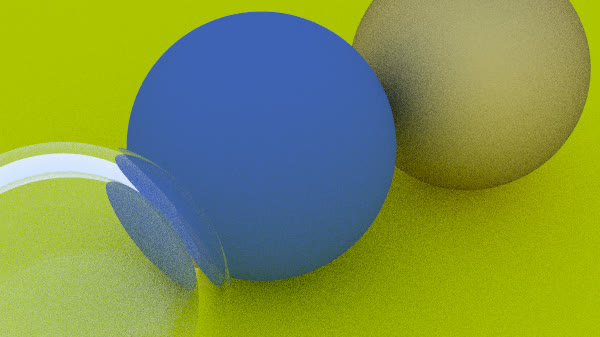
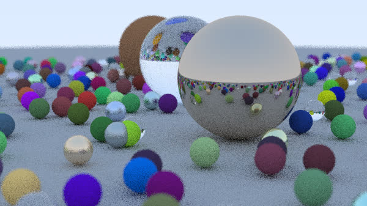
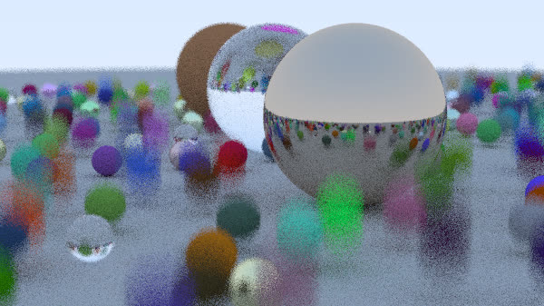

# Ray Tracer

A simple ray tracing engine written in C++.

## Features

- Monte Carlo ray tracing algorithm
- Depth of field
- Motion blur
- Materials: Lambertian, Metal, Dielectric
- Antialiasing
- Parallel rendering (pixel level)


## Outputs

### Depth of Field 

| Without Depth of Field | With Depth of Field |
|:----------------------:|:------------------:|
|  |  |

### Motion Blur 

| Without Motion Blur | With Motion Blur |
|:-------------------:|:---------------:|
|  |  |

## Setup

**Dependencies:**  
- [CMake](https://cmake.org/) (version 3.20 or higher recommended)  
- [OpenMP](https://www.openmp.org/) (for parallel processing support)  
- C++ compiler with C++20 support

To build the project:
```bash
mkdir build
cd build
cmake ..
make
```

## Usage

Render an image and save it as a PPM file:
```bash
./build/raytracer > generated_images/output.ppm
```


## Acknowledgment

Based on the [Ray Tracing in One Weekend](https://raytracing.github.io/) book.